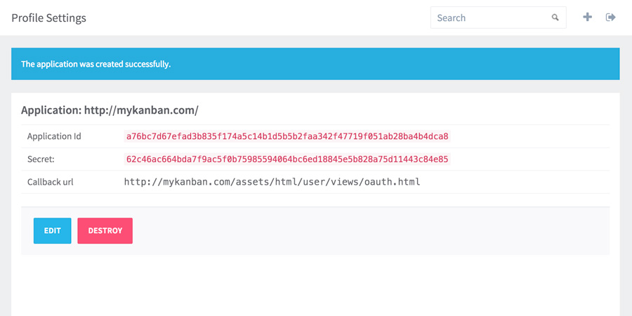
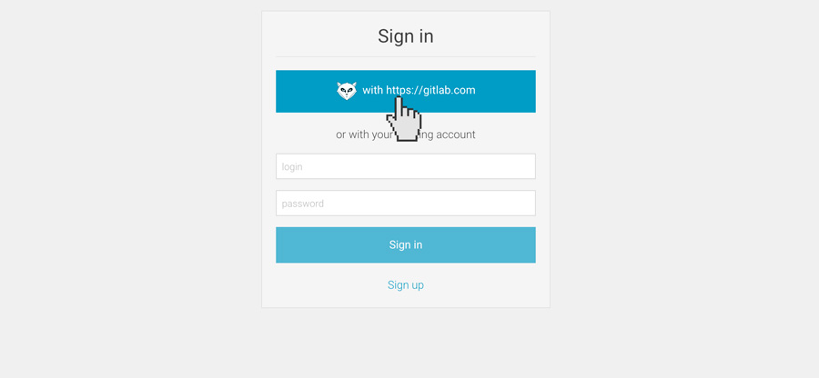

# Installation with docker

We assume that you have already installed [Docker](https://www.docker.com/) and optionally [docker-compose](https://docs.docker.com/compose/).

**NOTE** We are providing [docker-compose.yml](/docker-compose.yml) which we are supporting, which could ease the setup for you.


## Running the image

LeanLabs Kanban image requires Redis, which [we are also providing](https://hub.docker.com/r/leanlabs/redis/), it is just 6Mb is size, which is much smaller then official redis docker image.

1. Start the Redis container:

    ```bash
    docker run -d -p 6379:6379 --name kanban_redis leanlabs/redis:1.0.0
    ```

    This will start redis container with name kanban_redis, in daemon mode, mapping it 6379 port to host 6379 port.

2. Start kanban container:

    ```bash
    docker run -d
        --link kanban_redis:kanban_redis
        -p 80:80
        -e KANBAN_SERVER_HOSTNAME="http://localhost"
        -e KANBAN_GITLAB_URL="http://mygitlab.com"
        -e KANBAN_REDIS_ADDR="kanban_redis:6379"
        leanlabs/kanban:1.4.0
    ```

    This will start kanban board container in daemon mode, linked to redis container.

    That is basically all you need, now you should be able to access kanban board via http://localhost, if you want to setup OAuth access please refer to next section.

## Setting up OAuth via GitLab

1. Setup application for OAuth in GitLab.

    Go to your GitLab profile section "Application" and press button "New Application"

    

    After this you will see "New application" form, where "Name" is arbitrary name, e.g. "kanban", and "Redirect URI" is an URL in kanban where users will be sent after authorization in GitLab.

    
    
    **IMPORTANT** The "Redirect URI" is composed of 2 parts: the hostname of you kanban installation, and the fixed path part, referring to actual route to redirect. 

    The path part always the same -  "/assets/html/user/views/oauth.html", the hostname part strongly depends on kanban container "KANBAN_SERVER_HOSTNAME" environment variable, the hostname of redirect uri and env variable must be the same, including protocol and port information. 

    **IMPORTANT** Redirect URL must include port if not 80 or 443. 

    Here are some examples of composing redirect uri:

    KANBAN_SERVER_HOSTNAME=http://mykanban.com, then the "Redirect URI" must be "http://mykanban.com/assets/html/user/views/oauth.html"

    KANBAN_SERVER_HOSTNAME=http://mykanban.com:9000, then "Redirect URI" must be "http://mykanban.com:9000/assets/html/user/views/oauth.html"

    For now we does not support setting up kanban in GitLab "subdirectory", e.g. you can not setup kanban to be accessed via "http://mygitlab.com/kanban", this is planned in future releases.

2. Pass OAuth client id and client secret to kanban. 

    After registering application in GitLab you should provide OAuth client ID and client secret to kanban.
    
    

    They are passed to container via environment variables:

    **KANBAN_GITLAB_CLIENT** - GitLab OAuth client id

    **KANBAN_GITLAB_SECRET** - GitLab OAuth client secret

    Now the command to running the kanban container should be:

    ```bash
    docker run -d -p
        --link kanban_redis:kanban_redis
        -p 80:80
        -e KANBAN_SERVER_HOSTNAME="http://localhost"
        -e KANBAN_GITLAB_URL="http://mygitlab.com"
        -e KANBAN_GITLAB_CLIENT="Application ID"
        -e KANBAN_GITLAB_SECRET="Secret"
        -e KANBAN_REDIS_ADDR="kanban_redis:6379"
        leanlabs/kanban:1.4.0 
    ```
    Now you should be able to access kanban via GitLab OAuth.

    

## Environment variables

LeanLabs kanban docker container configuration is based on environment variables.

**NOTE** The variables that are not explicitly set will take the default values.

Here are the list of available variables and their meaning:

- **KANBAN_SERVER_LISTEN** - default to "0.0.0.0:80", IP:PORT (e.g. 0.0.0.0:80) which kanban will listen for incoming requests, when setting up with docker you rarely if ever will need to set this variable

- **KANBAN_SERVER_HOSTNAME** - default to "http://localhost", URL on which LeanLabs Kanban will be reachable (e.g. http://mykanban.com). The hostname must be composed of the protocol part ("http://" or "https://"), the domain or ip (e.g. mykanban.com or 192.168.0.100) and the port, if not 80 or 443 (e.g. ":9000"). For example, if board will be reachable on domain "mykanban.com" and port 9000 the resulting value must be "http://mykanban.com:9000".

- **KANBAN_SECURITY_SECRET** - default to "qwerty", this string is used to generate user auth tokens. Kanban uses json web tokens to identify users, this string is used to encrypt those tokens. You must change it to something more random then "qwerty" if you installation could be exposed to the whole internet.

- **KANBAN_GITLAB_URL** - default to "https://gitlab.com", your GitLab host URL, if you use self hosted GitLab installation the value must also include the protocol, domain or ip and the port if not 80 or 443. 

    **WARNING** The kanban board should be able to resolve GitLab installation domain. If you GitLab installation domain could not be resolved, then you must explicitly define the GitLab server IP, you could do this by passing --add-host to docker run command, e.g. --add-host="mygitlab.com:192.168.0.200".

- **KANBAN_GITLAB_CLIENT** - default to "qwerty", your GitLab OAuth client id

- **KANBAN_GITLAB_SECRET** - default to "qwerty", your GitLab OAuth client secret key

- **KANBAN_REDIS_ADDR** - default to "127.0.0.1:6379", Redis server address - IP:PORT. LeanLabs Kanban requires redis server to function properly, it stores users identities there.

- **KANBAN_REDIS_PASSWORD** - default to "" (empty string), Redis server password if any.

- **KANBAN_REDIS_DB** - default to "0", redis server database numeric index, from 0 to 16, also rarely required to be changed if ever.

## Setting up behind proxy.

LeanLabs Kanban board processes http requests directly, but sometimes you want to set it behind proxy, e.g. if you want https you definitely should use proxy, because for now kanban does not able to handle https traffic directly.

Proxy configuration, including supported configuration files also [described in our docs](/docs/configuration/).
